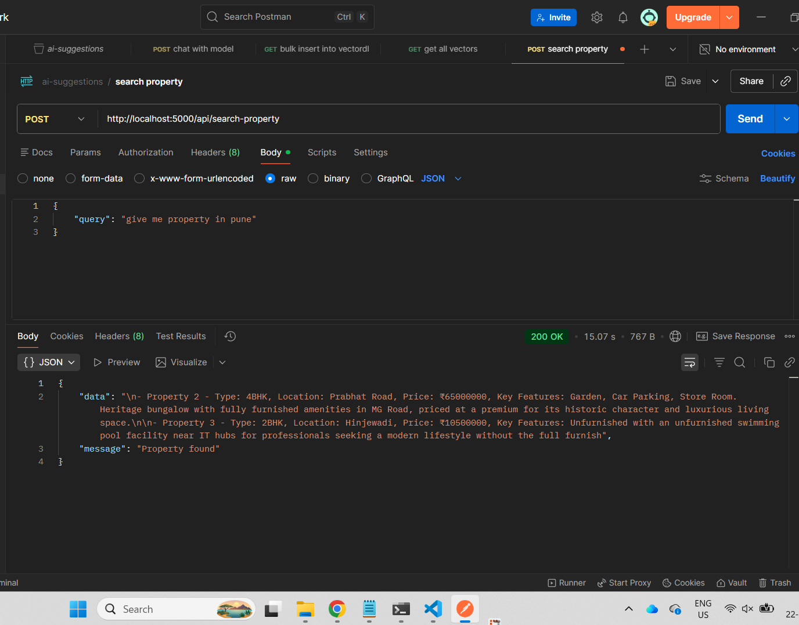

# 🏠 AI Property Recommendation System (RAG Based)

## 📌 Overview

This project is an AI-powered property recommendation system built using:

- **Node.js (Backend)**
- **MySQL (Structured Data)**
- **Qdrant (Vector Database)**
- **Ollama (LLM for response generation)**

The system uses a **RAG (Retrieval-Augmented Generation)** approach to provide accurate and controlled responses based only on available property data.

---

## 🚀 Features

- 🔍 Semantic property search using vector embeddings
- 🧠 AI-generated responses using Ollama
- 📊 MySQL for storing full property details
- ⚡ Qdrant for fast similarity search
- 🎯 Strict domain restriction (property-only queries)
- 🚫 No hallucination (AI only uses provided data)
- 📉 Budget, location, and type-based filtering (extensible)

---

## 🏗️ Architecture

```
User Query
   ↓
Query Validation (Backend)
   ↓
Vector Search (Qdrant)
   ↓
Fetch Data (MySQL)
   ↓
Filtering + Ranking (Backend Logic)
   ↓
Context Building
   ↓
Ollama (AI Response)
   ↓
Final Answer
```

---

## 📂 Project Structure

```
backend/
│
├── controllers/
│   ├── chatController.js
│   └── vectorController.js
│
├── routes/
│   ├── chatRoute.js
│   └── searchRoute.js
│
├── vectorDB/
│   ├── searchVector.js
│   ├── vectorModel.js
│
├── ai/
│   ├── ollama.js
│   ├── embedder.js
│   └── qdrant.js
│
├── models/
│   └── propertiesModel.js
│
├── utils/
│   ├── formatter.js
│   └── extractFilters.js
│
└── server.js
```

---

## ⚙️ Setup Instructions

### 1. Install Dependencies

```bash
npm install
```

---

### 2. Start Qdrant

```bash
qdrant.exe
```

Runs on:

```
http://localhost:6333
```

---

### 3. Start Ollama

Make sure Ollama is running:

```bash
ollama run llama3
```

---

### 4. Setup MySQL

```sql
CREATE DATABASE ai;

USE ai;

-- properties table (already defined in project)
```

---

### 5. Insert Data

- Add property data into MySQL
- Run vector insertion script to store embeddings in Qdrant

---

### 6. Start Backend Server

```bash
npm run dev
```

---

## 📡 API Endpoints

### 🔹 Chat API

```
POST /api/chat
```

#### Request

```json
{
  "message": "2BHK in Pune under 1 crore"
}
```

#### Response

```json
{
  "answer": "Here are some suitable properties...",
  "results": [...]
}
```

---

### 🔹 Search API (Optional)

```
POST /api/search
```

---

## 📸 Screenshots (Dynamic)

> 📌 Just create a `screenshots` folder in your project root and drop images inside it.
> No configuration required — GitHub will automatically render them.

---

### 🔹 API Testing (Postman)



---

## 📁 Screenshot Folder Structure

```
project-root/
│
├── README.md
├── screenshots/
│   ├── chat-request.png
│   ├── chat-response.png
│   ├── search-response.png
│   ├── ui-home.png        (future)
│   ├── ui-chat.png        (future)
│   └── ui-cards.png       (future)
```

---

## 🔄 Add / Update Screenshots Anytime

Just follow:

1. Add image → `screenshots/your-image.png`
2. Use it anywhere in README:

```md

```

✔ No path issues
✔ No rebuild needed
✔ Works automatically on GitHub

---

## 🧠 How It Works

### 1. User Query

User sends a natural language query.

### 2. Validation

Backend ensures the query is property-related.

### 3. Vector Search

Query is converted to embedding and matched in Qdrant.

### 4. Data Fetch

Matching property IDs are used to fetch full data from MySQL.

### 5. Filtering & Ranking

Backend applies logic (city, price, type, etc.).

### 6. Context Building

Clean, structured text is generated.

### 7. AI Response

Ollama generates a human-friendly response using strict rules.

---

## ⚠️ Important Design Principles

- ❗ AI is NOT the decision maker
- ✅ Backend controls filtering and logic
- ✅ AI is only used for formatting and explanation
- 🚫 No external knowledge allowed

---

## 🔒 Limitations

- No conversation memory (single query system)
- Basic filter extraction (can be improved)
- Depends on data quality

---

## 🚀 Future Improvements

- 🔥 Advanced query parser (price, city, intent detection)
- 💬 Conversation memory
- 📊 Ranking algorithms
- 🧾 Structured JSON responses for UI
- 📈 Performance optimization

---

## 🧪 Example Queries

- "2BHK in Mumbai"
- "cheap property in Pune"
- "luxury villa in Bangalore"
- "office space in BKC"

---

## ❌ Invalid Query Example

```
"Who is PM of India?"
```

Response:

```
"I can only help with property-related queries"
```

---

## 🏁 Conclusion

This system demonstrates a **production-ready RAG architecture** where:

- Backend ensures correctness
- Vector DB enables smart search
- AI enhances user experience

---

## 👨‍💻 Author

Sachin P

---
